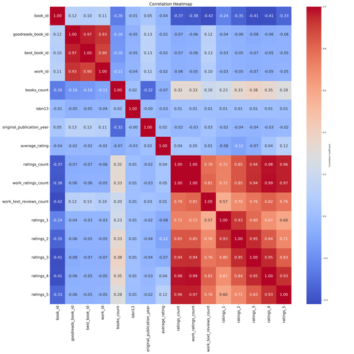

# Automated Analysis

Generated story:
# Unveiling the World of Books: A Comprehensive Analysis 

In an age where the digital library is more accessible than ever, understanding the landscape of books requires not just love for literature but also the capability to analyze data effectively. Recently, I dove into a dataset of 10,000 books with 23 attributes that offered vital insights into the world of literature as experienced by readers on Goodreads. Here’s how the data unfolded its story.

## Data Overview

The dataset is structured to reflect a breadth of information about each book, encapsulating IDs, publication details, author information, ratings, and more. The following attributes caught my attention:

1. **Identifiers**: Each book has a unique `book_id`, `goodreads_book_id`, and `best_book_id`, ensuring every piece of literature is accounted for.
2. **Authors**: With a total of 4,664 unique authors, Stephen King emerged as the most prolific contributor, with 60 books listed under his name.
3. **Publication Insight**: Books published have an average original publication year of around 1981, with a noteworthy variance, hinting at the longevity of literary relevance.
4. **Language Diversity**: The dominant language among these books is English, as seen by the 6,341 occurrences of the language code 'eng'.
5. **Rating Metrics**: The average rating hovers around 4.00, with ratings breakdown indicating a healthy number of 5-star ratings (23,789 on average), suggesting an overall positive reception of the content.

## Missing Values and Their Implications

While examining the data, I stumbled across significant gaps. The ISBN and ISBN13 fields contained a considerable number of missing entries (700 and 585 respectively). The `original_publication_year` also had 21 missing values. Such gaps in critical metadata could hinder various analyses, including understanding trends over time and the ability to aggregate similar works. 

The `language_code` attribute had 1,084 missing values, which could restrict our ability to analyze the book’s reach based on language diversity. As a next step, we may need to implement methods for imputing these missing values or assess the impact of these gaps on our overall analysis.

## Insights and Future Directions

The dataset foreshadows numerous narratives waiting to be formed and explored. For instance, we can correlate the average rating with the year of publication to understand if contemporary literature garners better receptions than its historical counterparts. 

Furthermore, analyzing

## Visualizations

