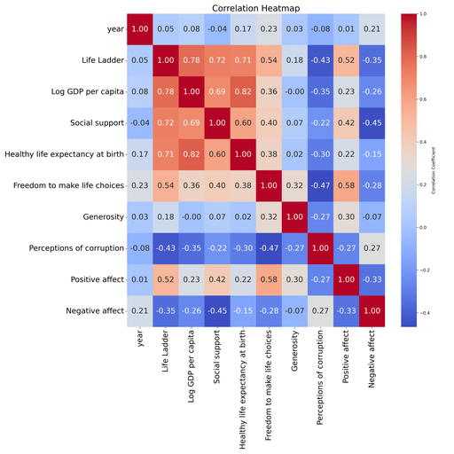

# Automated Analysis

Generated story:
# Understanding Global Happiness: Insights from Recent Data Analysis

## Introduction

In a world characterized by diverse cultures, economies, and political environments, measuring happiness can be a complex task. A recent dataset comprising 2,363 observations spanning 11 variables related to global happiness has provided us with a rich tapestry of insights. By examining various aspects like Life Ladder, GDP per capita, social support, and perceptions of corruption, we can better understand the factors correlating with happiness across countries and over the years.

## Dataset Overview

The dataset under consideration captures various indicators from 165 different countries over a period of time, with a mean year of 2014. The variables include:

- **Country name**: Categorical representation of the countries.
- **Year**: The year of data collection.
- **Life Ladder**: A measure of subjective well-being and happiness.
- **Log GDP per capita**: The logarithm of gross domestic product per capita, representing economic prosperity.
- **Social support**: Indicates the level of perceived support from family and community.
- **Healthy life expectancy at birth**: A projection of the number of healthy years a newborn can expect to live.
- **Freedom to make life choices**: A scale measuring individuals' freedom to make personal choices.
- **Generosity**: The degree of altruism exhibited by individuals in a given country.
- **Perceptions of corruption**: The extent to which individuals believe corruption is prevalent in their government and institutions.
- **Positive affect**: The frequency of positive emotions experienced by individuals.
- **Negative affect**: The prevalence of negative emotions experienced by individuals.

The dataset is generally well-structured, with minimal missing values in the 'Country name' and 'year' fields, yet is marked by notable gaps in 'Log GDP per capita,' 'Social support,' and particularly 'Generosity' (81 missing values).

## Summary of Findings

### Key Statistics

1. **Life Ladder**: The average score is approximately 5.48, suggesting a moderate level of happiness across the dataset. The minimum recorded score is 1.281, while the maximum sits at 8.019, indicating considerable variance.
  
2. **Log GDP per capita**: The economic metric shows a mean of 9.40, suggesting that wealthier nations typically rank higher on the happiness scale. However, with 28 missing entries, the correlation may not be wholly representative.

3. **Social support and Healthy life

## Visualizations

