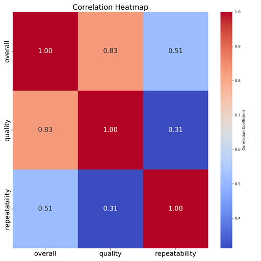

# Automated Analysis

Generated story:
# Unwrapping Insights from Movie Data: A Deep Dive into Language, Quality, and More

In the world of streaming and digital entertainment, understanding the audience's preferences and behavior is crucial for tailoring content and marketing strategies. Recently, we analyzed a dataset comprising 2,652 entries related to various movie titles, providing us a glimpse into the trends and user ratings in the film industry. Let’s dive into the data and extract some meaningful insights.

## Dataset Overview

Our dataset contains 8 variables, including:

- **date:** Date of the entries
- **language:** Language of the movie
- **type:** Type of content (primarily movies)
- **title:** Title of the movie
- **by:** Creator or leading actor/actress
- **overall:** Overall rating (1-5 scale)
- **quality:** Quality rating (1-5 scale)
- **repeatability:** How likely users are to watch the movie again (1-3 scale)

With a total of 2,652 records, we found some missing values in the 'date' (99 entries) and 'by' (262 entries) fields, highlighting areas that might require further attention.

## Insights Gained

### Language

The most prevalent language in our dataset is English, which appears 1,306 times across various entries. Given the global reach of Hollywood and its influence, it's not surprising to see a dominating presence of English-language films. However, the presence of entries in other languages suggests an opportunity for platforms to diversify the selection, catering to audiences with different linguistic preferences.

### Type of Content

A staggering 83.3% of the dataset pertains to movies, specifically 2,211 entries. This indicates a strong focus on film content — perhaps a reflection of the steady demand for cinematic experiences as opposed to TV shows or documentaries. 

### Titles and Creators

Among the titles, "Kanda Naal Mudhal" stands out as the most frequently mentioned movie, noted 9 times. This suggests that it might be a significant film attracting attention or repeated viewership. Additionally, Kiefer Sutherland is recognized as the leading creator with 48 mentions. These details can influence marketing strategies — focusing on key popular titles and notable actors can engage the audience more effectively.

### Ratings Analysis

Looking at the ratings:
- The **overall rating** has a mean of approximately 3.05 with a standard deviation of 0.76, indicating that users generally have a

## Visualizations

